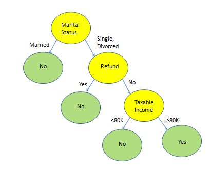

# Decision-tree-from-Scratch

# Decision Tree

Decision treee builds classification or regession models in the form of a tree structure by breaking down a dataset into smaller and smaller subsets by taking series of decisions.   
This tree can be learned by splitting the source set into subsets repeatedly in a recursive manner based on attribute value test.  

**To build decision tree:**
- ask a series of questions about one of the attributes in a given record.
- answer to one question decides what question to ask next.
- continue asking questions until we can infer the class of the given record.

### Structure of decision tree:
It is of hierarchial structure   
**Root node:** Each decision tree has only one root node. It is a node with zero incoming edge, zero or more outgoing edges.   
**Internal nodes:** It is a node with exactly one incoming edge, two or more outgoing edges.  
**Leaf node:** It is a node with exactly one incoming edge and no outgoing edge.  
**Note:** Each leaf node is assigned a class label and non-leaf node contains a test condition on one of the attributes.  

Eg:

|Refund|Marital Status|Taxable Income|Cheat|
|:-:|:-:|:-:|:-:|
|Yes|Single|125K|No|
|No|Married|100K|No|
|No|Single|70K|No|
|Yes|Married|120K|No|
|No|Divorced|95K|Yes|
|No|Married|60K|No|
|Yes|Divorced|220K|No|
|No|Single|85K|Yes|
|No|Married|75K|No|
|No|Single|90K|Yes|  

* **Marital Status, Refund and Taxable income are splitting attributes** 
* **Green coloured nodes are leaf nodes**  

## Applying Model to Test Data
|Refund|Marital Status|Taxable Income|Cheat|  
|:-:|:-:|:-:|:-:|
No|Married|80K|?|  

1. Start from the root of tree
2. Check the condition of attribute in that node
3. Move to next node depending on the answer
4. Repeat 2 and 3 until leaf node is reached

**For example applying test data on above decision tree:**  
Marital Status: Married-> No     
This data is classified as class No   

# Challenge in learning a decision tree
- Exponentially many decision trees can be constructed from a given set of attributes.
    - Some of the trees are more accurate classifers than the others
    - Finding the optimal tree is computationally infeasible

**Efficients algorithms are available to learn a reasonably accurate decision tree in reasonable time**

### Greedy Strategy:
**Split the records based on an attribute test that optimizes certain criterion**  

# Issues: 
- How to specify the attribute test condition?
    It depends on attribute types and number of ways to split
    - Attribute types: Nominal, Ordinal, Continuous
    - Number of ways to split: 2-way split, Multi-way split
    
- How to determine the best split?  
    Nodes with homogeneous class distribution are preferred. We need some splitting measure. 
    Measures of node impurity:
        - Gini Index
        - Information Gain
        - Misclassification error
        
- How to determine when to stop splitting?

# Gini Index:  
It measures the degree/probability of a particular variable being wrongly classified when it is randomly chosen.  
Minimum: 0 (when all elements belong to a certain class). 
Maximum: 1-1/n_c(for equally distributed elements) Prefer the attribute with least Gini index.
  
When a node p is split into k partitions(children), the quality of split is computed as,  

ni is number of records at child i  
    
n is number of records at node p
    

# Information Gain:
Information Gain is used to determine which attribute gives us the maximum information about a class. It is based on entropy(degree of uncertainty)

**Entropy of a Node:** 
  
   

pi denotes the probability of class i  

**Gain split:**  
It measures the reduction in entropy achieved because of the split. Choose the split that achieves most reduction(maximizes GAIN)  

When a node p is split into k partitions(children), the quality of split is computed as, 

 

Its drawback is that it prefers splits that result in large number of partitions, each being small but pure.  

**Gain Ratio:**  
It is designed to overcome the disadvantage of information gain. It adjusts Gain by penalizing the large number of small partitions. 

     
  

# Misclassification Error: 

